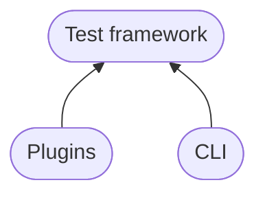

`ddev` is the Datadog Agent integration developer tool (`datadog-checks-dev`). It provides everything you need to develop, test, validate, and release Datadog Agent integrations from a single command-line interface.

The package is fundamentally split into two components that work together but maintain a clear separation of concerns.

## Two components

### Test framework

The test framework provides everything necessary to test integrations:

- Dependencies such as [pytest](https://github.com/pytest-dev/pytest), [mock](https://github.com/testing-cabal/mock), and [requests](https://github.com/psf/requests)
- Utilities for consistently handling complex logic and common operations
- An orchestrator for arbitrary E2E environments

### CLI

The CLI provides the interface through which you invoke tests, manage E2E environments, and perform general repository maintenance such as dependency management and releases.

## Import hierarchy

The CLI tooling may import from the test framework, but not vice versa — the test framework's dependencies are a strict subset of what the CLI requires.



Both the CLI and the Plugins component depend on the test framework. This means the test framework must remain importable without any CLI-only dependencies present, which is important for integrations that still support Python 2.7.

<Warning>
Some integrations still support Python 2.7 and must be tested with it. As a result, parts of the test framework — including the pytest plugin — must remain compatible with Python 2.7.
</Warning>

## Installation

Install `ddev` using `pip` or `pipx`:

<CodeGroup>

```bash pipx (recommended)
pipx install ddev
```

```bash pip
pip install ddev
```

</CodeGroup>

<Tip>
Using `pipx` isolates `ddev` in its own virtual environment and keeps it available globally without interfering with other Python projects.
</Tip>

## Key use cases

<CardGroup cols={2}>
  <Card title="Run tests" icon="flask" href="/ddev/cli">
    Use `ddev test` to run unit, integration, and E2E tests for any integration or all changed integrations at once.
  </Card>
  <Card title="Manage E2E environments" icon="docker" href="/ddev/cli">
    Use `ddev env start`, `ddev env test`, and `ddev env stop` to spin up live Agent environments backed by Docker or Vagrant.
  </Card>
  <Card title="Validate integrations" icon="circle-check" href="/ddev/cli">
    Use `ddev validate` to verify configuration specs, metadata, licenses, imports, and more before opening a pull request.
  </Card>
  <Card title="Manage releases" icon="tag" href="/ddev/cli">
    Use `ddev release changelog new` to create changelog entries and `ddev release make` to cut new integration releases.
  </Card>
</CardGroup>

## Explore further

<CardGroup cols={2}>
  <Card title="Configuration" icon="gear" href="/ddev/configuration">
    Set up your global config file, repository paths, Agent builds, and organization credentials.
  </Card>
  <Card title="CLI reference" icon="terminal" href="/ddev/cli">
    Complete reference for all `ddev` commands and their flags.
  </Card>
  <Card title="Plugins" icon="plug" href="/ddev/plugins">
    Understand the pytest plugin, environment manager, and all available test fixtures.
  </Card>
  <Card title="Multi-repo and worktrees" icon="code-branch" href="/ddev/multirepo">
    Use `.ddev.toml` overrides to work seamlessly across multiple repositories and Git worktrees.
  </Card>
</CardGroup>
